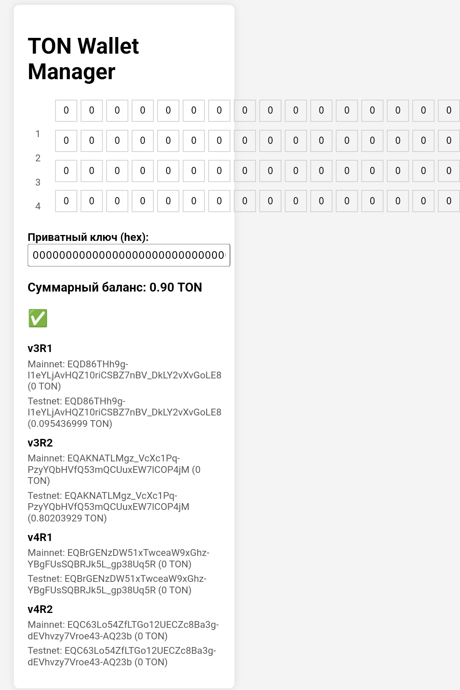

# TonVisualKey
Визуальный приватный ключ The Open Network (TON)
# TON Wallet Visual Private Key


## Описание проекта

**TON Visual Key** — это инструмент для просмотра кошельков в блокчейне TON (The Open Network). Проект позволяет:
- Генерировать приватные ключи в hex-формате.
- Создавать адреса для всех версий кошельков (v3R1, v3R2, v4R1, v4R2).
- Проверять балансы в сетях **mainnet** и **testnet**.

Проект состоит из:
- **Сервера** на Node.js, который взаимодействует с API TonCenter.
- **Визуального интерфейса** (HTML, CSS, JS) для удобного управления ключами и адресами.

---

## Как это работает

1. **Приватный ключ**:
   - Приватный ключ представлен в виде hex-строки длиной 64 символа (32 байта).
   - Ключ можно редактировать через визуальную сетку 16x4 или текстовое поле.

2. **Адреса кошельков**:
   - Для каждой версии кошелька (v3R1, v3R2, v4R1, v4R2) генерируются адреса в сетях **mainnet** и **testnet**.

3. **Балансы**:
   - Балансы проверяются через API TonCenter.
   - Отображается суммарный баланс для всех кошельков.

4. **Интерфейс**:
   - Визуальная сетка для редактирования ключа.
   - Отображение адресов и балансов в реальном времени.
   - Индикатор статуса (зелёный/красный крестик) в зависимости от суммарного баланса.

---

## Установка и запуск

### Требования
- Node.js

## Настройка

### API-ключи
Для работы с API TonCenter необходимо указать API-ключи в файле `server.js`:
```javascript
const MAINNET_API_KEY = 'ваш_mainnet_api_key';
const TESTNET_API_KEY = 'ваш_testnet_api_key';
```

### Приватный ключ
- Приватный ключ можно ввести через визуальную сетку или текстовое поле.
- Ключ должен быть длиной 64 символа (0-9, A-F).

---

## Структура проекта

- **server.js** — основной файл сервера.
- **public/** — папка для статических файлов:
  - **index.html** — HTML-файл.
  - **style.css** — CSS-файл.
  - **script.js** — JavaScript-файл.
- **node_modules/** — папка с зависимостями (создаётся автоматически).

---

## Используемые библиотеки

- **express** — для создания сервера.
- **tonweb** — для взаимодействия с блокчейном TON.
- **tweetnacl** — для генерации ключей.
- **cors** — для обработки CORS-запросов.

---

## Автор
Telegram: [Pamblus](https://t.me/Pamblus)
---
